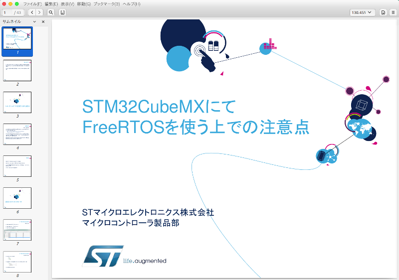
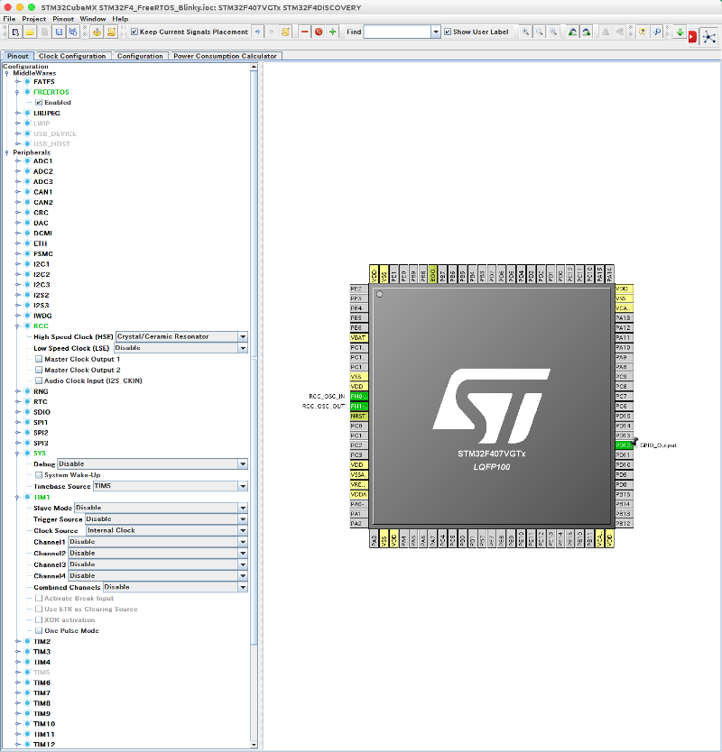
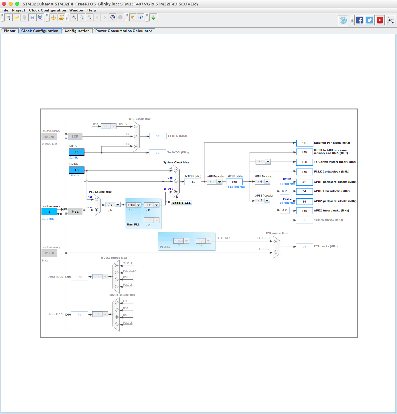
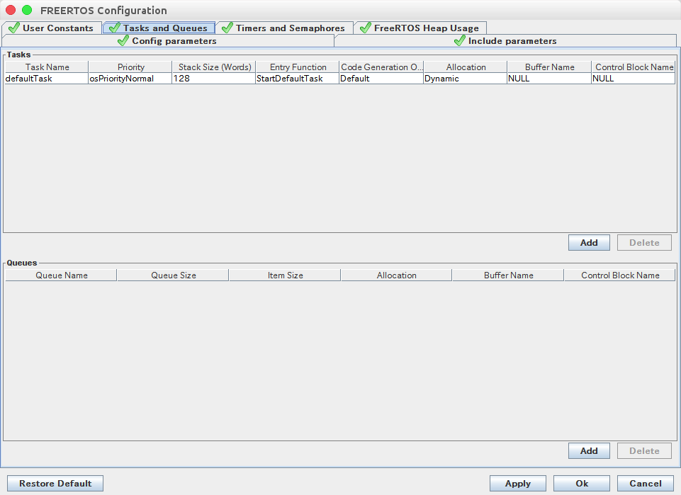
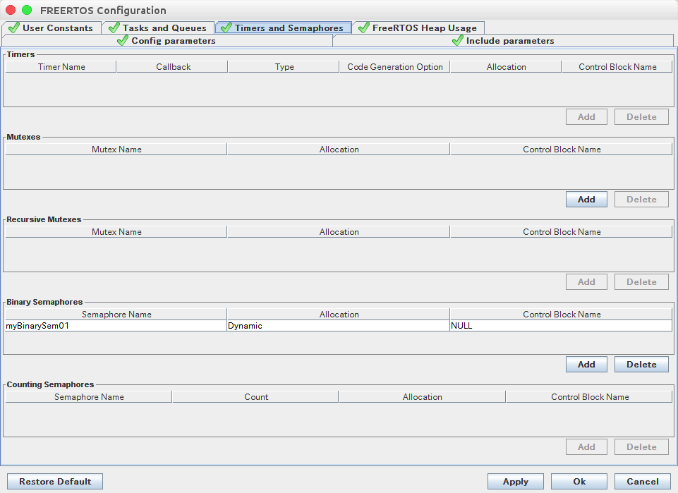
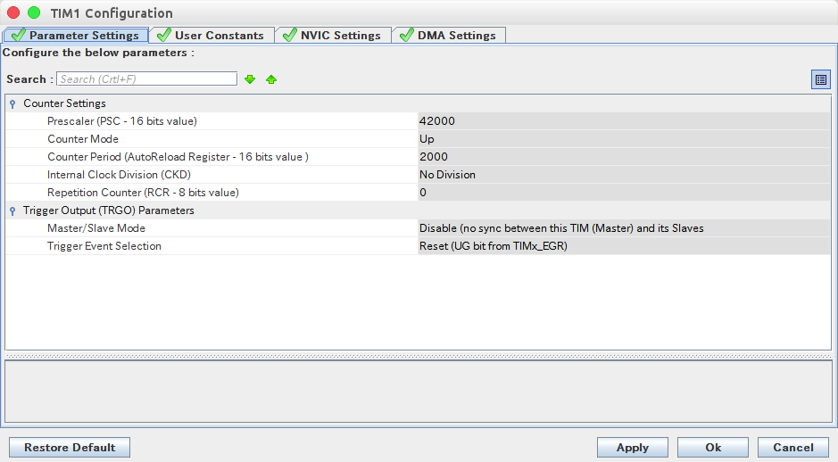
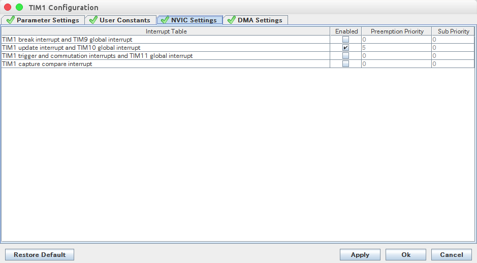
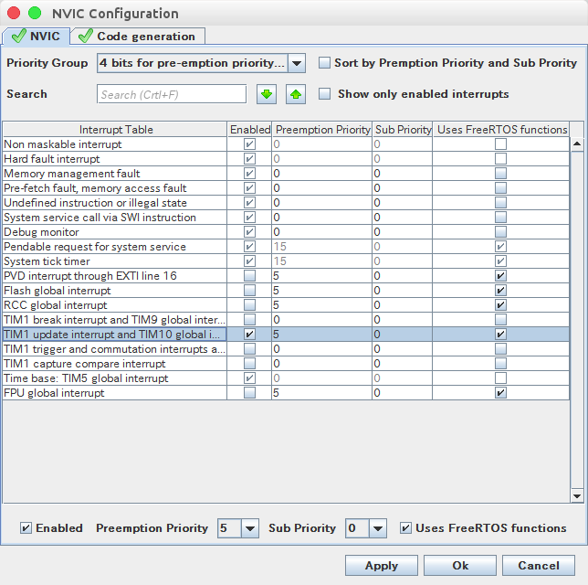

## SMT32F4 Discovery FreeRTOS Blinky

STM32F4 DiscoveryでFreeRTOSを使ってLチカする方法。
参考資料はSTMicroelectronics社の[CubeMX with FreeRTOSトレーニング資料](https://www.stmcu.jp/design/document/training-materials_j/51214/)

上記資料ではNUCLEO-F401REを使用した場合の説明ですが、F4 DiscoveryとはLEDのピンが違うだけなので、その部分だけを読み替えて実施した。

### Pinout

- FREERTOS Enabledに
- RCC High Speed Clockを設定
- SYS Timebase SourceをTIM5に
- TIM1 Clock SourceをInternal Clockに
- PD12（LED）をGPIO_Outputに

### Clock Configuration

### FreeRTOS Configuration

#### Tasks and Queues

#### Timers and Semaphores

### TIM1 Configuration

#### Parameter Settings

### NVIC Settings

### NVIC Configuration

#### NVIC

### stm32f4xx_it.cの変更

#### TIM5_IRQHandler()を編集

~~~
void TIM5_IRQHandler(void)
{
  /* USER CODE BEGIN TIM5_IRQn 0 */

  /* コード追加始め */
	/* TIM Update event */
	if(__HAL_TIM_GET_FLAG(&htim5, TIM_FLAG_UPDATE) != RESET) {
		if(__HAL_TIM_GET_IT_SOURCE(&htim5, TIM_IT_UPDATE) != RESET) {
			__HAL_TIM_CLEAR_IT(&htim5, TIM_IT_UPDATE);
			HAL_IncTick();
		}
	}
  /* コード追加終わり */
  /* USER CODE END TIM5_IRQn 0 */
  /* 以下１行をコメントアウト */
  //HAL_TIM_IRQHandler(&htim5);
  /* USER CODE BEGIN TIM5_IRQn 1 */

  /* USER CODE END TIM5_IRQn 1 */
}
~~~

### main.cの変更

#### HAL_TIM_PeriodElapsedCallback()を編集

~~~
void HAL_TIM_PeriodElapsedCallback(TIM_HandleTypeDef *htim)
{
  /* USER CODE BEGIN Callback 0 */
  /* コード追加始め */
	if(htim == &htim1) {
		osSemaphoreRelease(myBinarySem01Handle);
	}
  /* コード追加終わり */
  /* USER CODE END Callback 0 */
  /* 以下３行をコメントアウト */
  //if (htim->Instance == TIM5) {
  //  HAL_IncTick();
  //}
  /* USER CODE BEGIN Callback 1 */

  /* USER CODE END Callback 1 */
}
~~~

#### StartDefaultTask()を編集

~~~
void StartDefaultTask(void const * argument)
{

  /* USER CODE BEGIN 5 */
  /* Infinite loop */
  for(;;)
  {
    /* コード追加始め */
	  osSemaphoreWait(myBinarySem01Handle, osWaitForever);
	  HAL_GPIO_TogglePin(GPIOD, GPIO_PIN_12);
    /* コード追加終わり */
    /* 以下１行をコメントアウト */
    //osDelay(1);
  }
  /* USER CODE END 5 */
}
~~~

#### main()を編集

~~~
/* USER CODE BEGIN RTOS_QUEUES */
/* add queues, ... */
/* １行追加 */
HAL_TIM_Base_Start_IT(&htim1);
/* USER CODE END RTOS_QUEUES */

~~~
